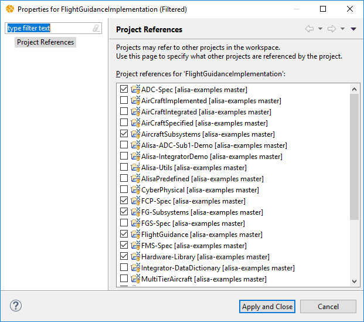
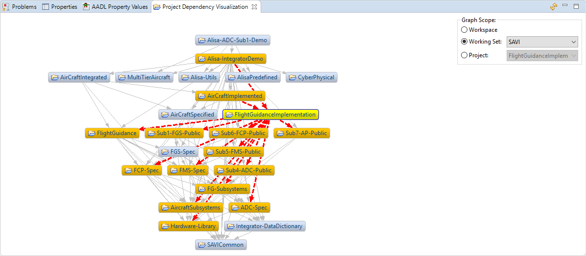

<!--
Copyright (c) 2004-2022 Carnegie Mellon University and others. (see Contributors file). 
All Rights Reserved.

NO WARRANTY. ALL MATERIAL IS FURNISHED ON AN "AS-IS" BASIS. CARNEGIE MELLON UNIVERSITY MAKES NO WARRANTIES OF ANY
KIND, EITHER EXPRESSED OR IMPLIED, AS TO ANY MATTER INCLUDING, BUT NOT LIMITED TO, WARRANTY OF FITNESS FOR PURPOSE
OR MERCHANTABILITY, EXCLUSIVITY, OR RESULTS OBTAINED FROM USE OF THE MATERIAL. CARNEGIE MELLON UNIVERSITY DOES NOT
MAKE ANY WARRANTY OF ANY KIND WITH RESPECT TO FREEDOM FROM PATENT, TRADEMARK, OR COPYRIGHT INFRINGEMENT.

This program and the accompanying materials are made available under the terms of the Eclipse Public License 2.0
which is available at https://www.eclipse.org/legal/epl-2.0/
SPDX-License-Identifier: EPL-2.0

Created, in part, with funding and support from the United States Government. (see Acknowledgments file).

This program includes and/or can make use of certain third party source code, object code, documentation and other
files ("Third Party Software"). The Third Party Software that is used by this program is dependent upon your system
configuration. By using this program, You agree to comply with any and all relevant Third Party Software terms and
conditions contained in any such Third Party Software or separate license file distributed with such Third Party
Software. The parties who own the Third Party Software ("Third Party Licensors") are intended third party benefici-
aries to this license with respect to the terms applicable to their Third Party Software. Third Party Software li-
censes only apply to the Third Party Software and not any other portion of this program or this program as a whole.
-->
# Project Dependency Visualization View

[TOC levels=2-4 bullet hierarchy]

## Introduction

The Project Dependency Visualization View displays a directed graph showing the dependencies between projects in your
workspace. This can be helpful when you have many projects which refer to each other and it is difficult to understand
their dependencies.

## Project References

The dependencies between projects are stored as Project References. These can be edited by right-clicking on a project
in the AADL Navigator and clicking **Edit Referenced Projects...**. This opens a dialog showing which projects the
selected project refers to.

## Opening the View

To open the Project Dependency Visualization view, click on **Window** -> **Show View** -> **Other...** in the main
menu. Select **AADL** -> **Project Dependency Visualization** and click **Open**.

## Graph Scope

The view can display all projects in the workspace or limit its contents to a specific scope. If the scope is limited,
it can be limited to a specific working set or a specific project. These options are displayed in the controls on the
right side of the view.

### Workspace

When **Workspace** is selected, all open projects are shown in the graph. Projects that do not refer to any other
project nor have other projects refer to it are shown as unconnected nodes in the graph.

### Working Set

When **Working Set** is selected, all open projects in the selected working set are shown in the graph. In addition to
that, any project outside of the working set that has a direct or indirect dependency connection to a project in the
working set is also shown. These additional projects are considered to be outside of the scope, but are still displayed
in the graph. Projects in the working set are shown with a light blue background color while projects outside of the
scope are shown with a gray background color.

### Project

When **Project** is selected, only the selected project is considered to be in scope. The graph consists of that project
plus any project that has a direct or indirect dependency connection to the selected project. The selected project is
shown with a light blue background color while the other projects are shown with a gray background color.

### Setting the Scope

The graph scope can be set from the controls on the right side of the graph, the AADL Navigator's context menu, or the
graph's context menu. If the scope is set from a context menu, then the state of the controls in the view will be
updated to reflect the currently selected scope.

In the AADL Navigator, the scope can be set by right-clicking on a working set or a project and clicking
**Visualize Project Dependencies**. This will set the scope to the selected working set or project.

The scope can also be set by right-clicking in the graph. This will bring up a context menu that allows the scope to be
set to the workspace. If the right-click was on a project in the graph, then there will be an option for setting the
scope to that project.

### Refreshing the Scope

Changes to working sets or projects are not immediately reflected in the graph. Use the Refresh button
() in the view's toolbar to rebuild the graph based upon the
currently selected scope.

## Interacting with the Graph

Nodes of the graph can be rearranged by dragging them around.

When clicking on a node in the graph, that selected node will be highlighted along with any other node directly
connected to it as well as the connections. This can be helpful for understanding complicated graphs. The selected node
will have a yellow background color. Nodes directly connected to the selected node will have an orange background color.
Connections in which one endpoint is the selected node will be red in color and dashed.

