# OSATE User Guide

OSATE is a complete modeling environment providing support for describing AADL models. It is composed of many features to model and analyse systems.  Also, a user can build their own tools based on OSATE and extend its initial capability.

This manual provides an overview of the basic features of OSATE and describes how to work with AADL models:

* Eclipse Basics
* Creating an AADL Project
* Writing Your First AADL Model
* Navigating the AADL Text Editor
* Instantiating Your Model
* Viewing AADL Prop

This manual also includes as reference material

* AADL Syntax Rules
* Suggested AADL Style Guide


## Eclipse Basics

OSATE is built on the Eclipse framework.  You may be familiar with Eclipse from using it for Java development.  OSATE inherits many concepts from Eclipse including

* **The Workbench.**  The main UI.
* **Projects.**   Work is divided into projects that group together related files.  Projects may be closed when they are not in use to prevent then from taking up OSATE reousrces and to prevent accidental modification.
* **Views.**  A view is a read-only display of information.  A view may be connected to a specific object in the OSATE workspace (often times the currenty selected object).
* **Editors.**  Not surprisingly, an editor provides write access to information in a project.  For example, OSATE has both a textual and graphical editor for AADL packages.
* **Perspectives.**  A perspective is a prearranged collection of views, editors, and toolbars focused around a particular task.  In OSATE you really only care about the `AADL` perspective.
* **Markers.**   A marker is a piece if information attached to a location in a file.  They are commonly used to report errors and warnings about files.  For example, OSATE uses markers to report syntax errors in AADL files.  Ananlysis plug-ins often use markers to communicate their results.  Markers are visible in several ways.  They are most commonly interacted with as annotations within editors and as a list in the `Problems` view.


### Eclipse Help

If you are unfamiliar with Eclipse, the "Workbench User Guide" in the Eclipse help system is an excellent introduction.  This can be accessed in OSATE by going to the `Help` menu in the main OSATE window and selecting `Help Contents`:


A new broweser window will open with a table of contents on the left-hand side.  The `Workbench User Guide` is he first document in the list:

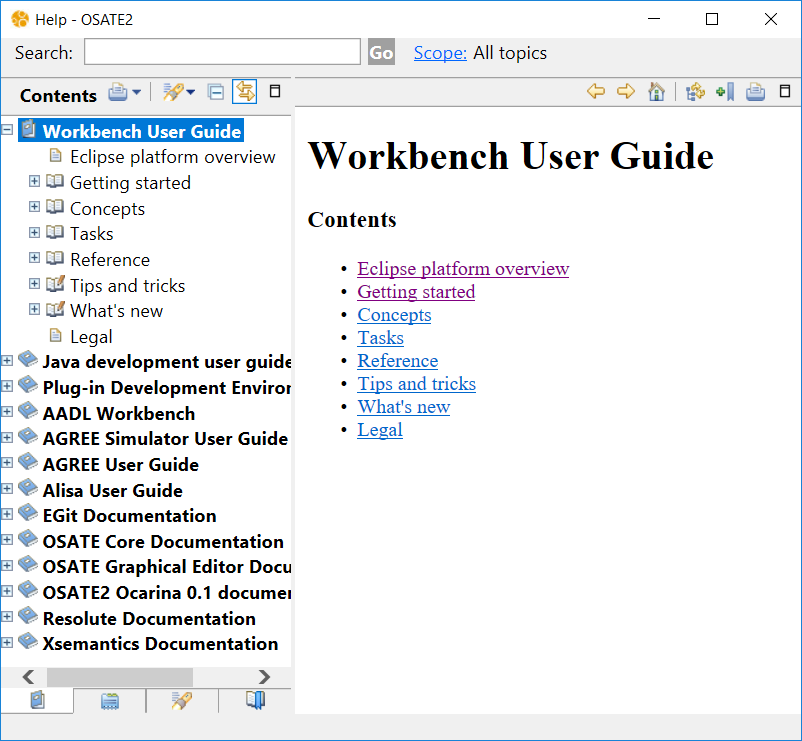


### The Workbench

All work in the OSATE is done through a _Workbench_.  This is the main window, and it generally fills most or all your screen.  The look and contents of the workbench are highly customizable, but it is uncommon to deviate too much from its default layout.  Generally it has 

* A row of toolbars along the top.
* A "navigator" view along the left-hand side.  This view displays all the available projects and their contents.  OSATE uses a customized `AADL Navigator` that also displays globally available AADL property sets provided by plug-ins.
* An "outline" view on the right-hand side.  This view interacts with the active editor window and displays a structured semantic or syntactic outline of the contents of the editor.  It can be used to quickly navigate the contents of the editor.
* The `Problems` view along the bottom.  This view is used to interact with markers.

The rest of the center space of the workbench is used to hold editor windows.  This layout can be seen in the workbench window below that is set to the OSATE `AADL` perspective:

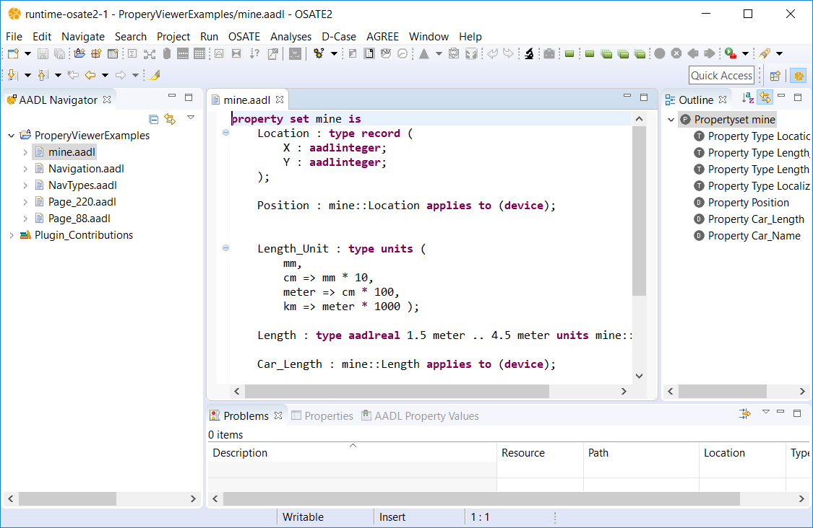

There are several other features of the workbench visible in the above image:

* Views can have their own toolbars.
* Views can be stacked into "tabbed" layouts.  Tihs is visible along the bottom of the workbench where there are tabs for the `Problems`, `Properties`, and `AADL Property Values` views.
* Views can have their own menus.  The menu is accessible by clicking on the downward facing triangle in the top right of the view's toolbar: .
* Views can be minimized or maximized within the workbench window using the toolbar buttons .
* Views can be closed by clicking on the "x" icon on their tab.


#### Commands

As an Eclipse-based application, OSATE makes its commands available in multiple modalities.  A single command is usually available

* In an OSATE menu
* In a toolbar
* In a context menu, when appropriate to the currently selected object.  (A context menu is uaually opened with a right-click in Windows, ore a `CTRL` + click in MacOS.)


#### Missing Views

If you accidently close a view or simply want to add an additioanl view to the workbench, you can open a view by using the `Window > Show View` submenu in the main OSATE menubar:


This menu is populated with views specific to the current perspective.  Here we see the `AADL Navigator` and `AADL Property Values` views specific to the `AADL` perspective.  If you do not see the view you need listed, choose the `Other...` option to bring up the `Show View` Dialog:


This dialog lists all the views avaible.  Views are grouped by category.  Above we see the `Error Log` view in the `General` category being selected for use.


#### Reseting the Perspective

If you open/close too many new views, rearrange your views, or otherwise put you workbench in a state that find unusable, you can bring it back to good state by resetting the perspective.  In the case of OSATE, you should reset the `AADL` perspective by bringing up the _context menu_ on the `AAADL` perspecitive icon on the right side of the workbench toolbar, and selecting `reset`:

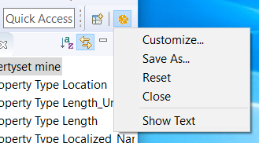

This returns the arrangement of views and editors to a the default layout defined by the perspective.


### OSATE Preferences

OSATE (via its Eclipse underpinnings) has an exhaustive set of preferences that can be changed.  These are accessed via the `Preferences` window.  Access to preferences follows the host operating system standards:

* For windows, the preferences are under `Window > Preferences`.
* For MacOS, the prefernece are under `OSATE > Preferences...`.

This brings up a window with a hierarchical list of settings on the left-hand side.

One setting of immediate interest is found under `General > Startup and Shutdown`.  By default the setting `Refresh workspace on startup` is not enabled.  Enabling it ensures that when starting up, OSATE updates its records to reflect any changes to the files in the workspace that may have occurred outside OSATE.


### Manual Refresh

You can manually initiate a refresh by selecting projects, folders, or files in the `AADL Navigator` and invoking `File > Refresh` in main menu or `Refresh` in the navigator's context menu.


## Creating an AADL Project

Let us create an AADL Project in OSATE.  To create a new AADL project in the workspace, click on the `New AADL Projec` button  in the OSATE toolbar.  A new project wizard will open:


Enter `MyFirstAADLProject` as the project name and click on the `Finish` button.  The wizard creates a new project.  It is visible in the `AADL Navigator` view.  Note the small `A` on the project that indicates it is an AADL Project:


### Built-in Proprety Sets

Also visible in the view is a library icon labeled `Plugin_Contributions`.  This view element collects all the AADL property sets avaoilable by default in OSATE:

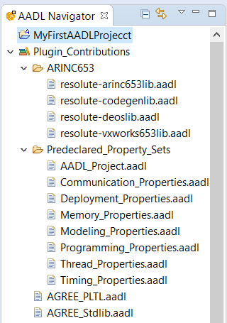

The `Predeclared_Property_Sets` are those that are specified by the AADL standard document and are provided by the core OSATE environment.  The others are specified in other documents and provided by plug-ins to OSATE.  For example `ARINC653` contains property sets specified in the ARINC653 annex to AADL and is provided by a plug-in.  Property sets in `Plugin_Contribution` may be used by any project in the workspace by providing the appropriate `with` clause in the package specification.  In particular, _they do not need to be copied into a project to be used_.


### Crating an AADL Package

Now that we have an AADL project in the workspace, we can populate it with an AADL Package:

1. Select the project `MyFirstAADLProject`.
2. Click on the `New AADL Package` button  in the OSATE toolbar to bring up the AADL package wizard:
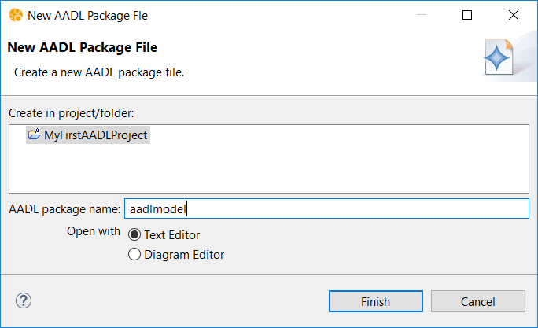
3. Enter`aadlmodel` for the package name and click on `Finish`.

OSATE creates the file `aadlmodel.aadl` in the project, populates it with a skeleton package declaratoin, and opens it in the AADL text editor:

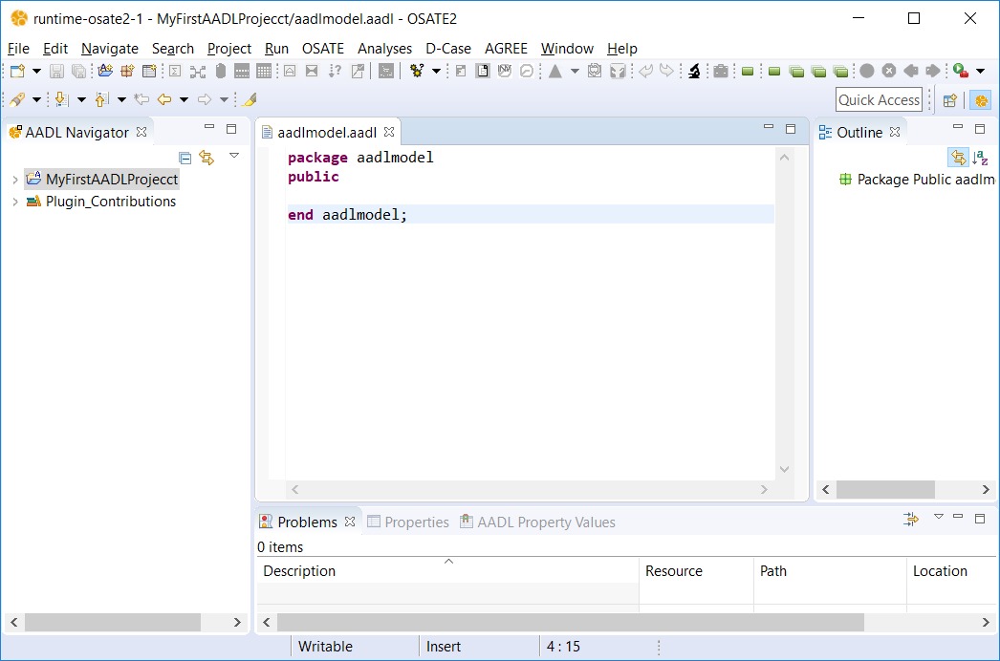

Note that the wizard has radio buttons that allow you to specify whether the package should be opened in the text editor or the graphical editor.  By default the text editor is selected.

Replace the contents of the editor with the simple model below:

```
package aadlmodel
public
	process MyProcess
	end MyProcess;
	
	system MySystem
	end MySystem;
	
	system implementation MySystem.i
		subcomponents
			sub1: process MyProcess;
	end MySystem.i;
end aadlmodel;
```

You can use copy-and-paste to copy the above into the editor, but if you type it directly, you can experience some of the syntwax-directed features of the aadl editor:

* The editor automatically closes blocks.  For example, when you type `process MyProcess` and enter a new line, the editor automatically inserts `end MyProcess;`.

* You can access the automatic completion (a.k.a. _autocomplete_) feature by typing `CTRL + Space` in Windows or `Command + Space` in MacOS.  This brinks up a small context menu displaying options ofr who the current string in the editor can be completed.  For example, below shows the result of activating autocomplete after typing `syst`:
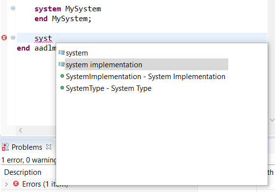
The menu shows that `syst` can be completed with the keywords `system`, and `system implementation`.  In this case we  want `system implementaton`.  You can select the compleletion with the moue or my using the arrow keys and hitting `return`.

  The list of completions also shows two more options.   This are _templates_ that insert a more complete system type or system implementation declration into the text.

* Autocompletion also works with declared names.  For example, below shows the result of activating autocomplete after typing `My`:
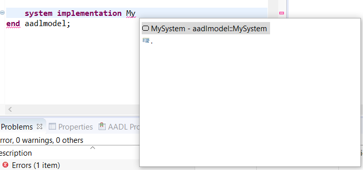
In this case, autocomplet suggests the system type name `MySystem`.  In particular, it _does not_ suggest the process type name `MyProcess` because it would be erroneous in the context of declarating a system implementation.


#### Error Markers

As you type you will notcie that the editor underlines syntax errors in red.  The right sidebar of the editor will also show a small red`x` indicating that an _error marker_ exists for that line of text.  For example, before the declaration of the system implementation is completed, the package has several errors:


The details of the error markers are visible in the `Problems` view.  This is a standard Eclipse view.  Despite the name _Problems_, not all markers necessarily makrk problems or errors.  Some OSATE analsyses generate information markers (visible with a blue `i`) as output.

The details of a marker can also be seen by hovering over the icon in the editor sidebar.

Also note that the AADL project is marked in the navigator view to indicate that its contents have error markers.


#### Save the Package

Once you have the package entered into the editor, save it.  It should be error-free, without any markers:

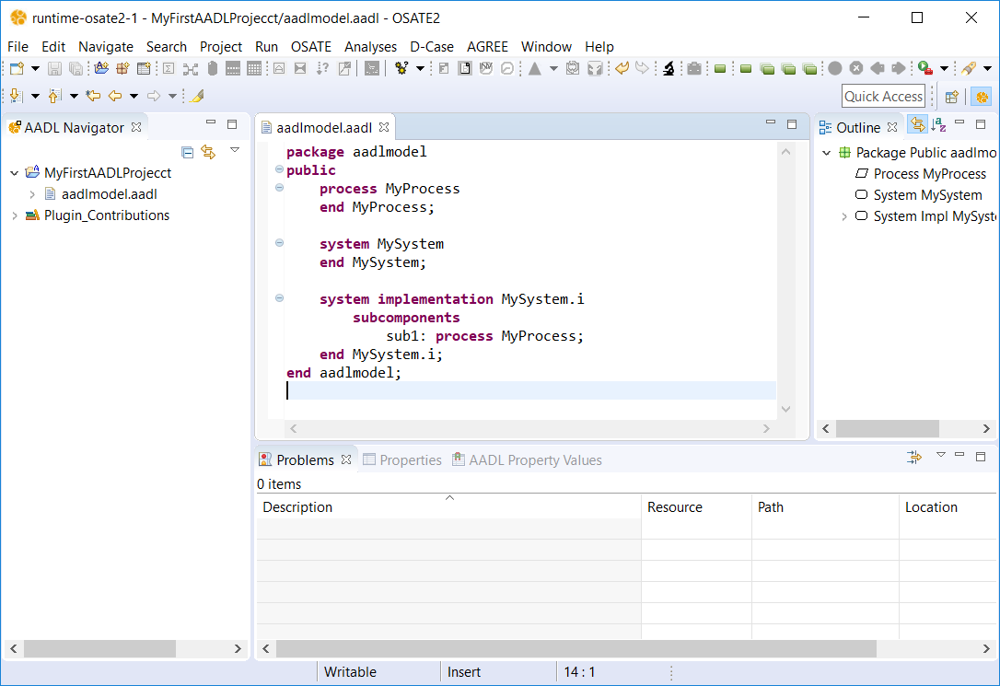


## Navigating a Model

OSATE provides many mechanisms for navigating through a model.


### The `Outline` View

The `Outline` view shows the model in the text editor as a tree structure. Selecting an element in the outline view causes the editor to move to that object in the text. You can disable this synchronization between the outline and the text with the double arrow button in the view's toolbar. You can also have the view sorted alphabetically instead of the order in the text by selecting the "a to z" icon.


### Search

You can search the text of a model using the standard Eclipse search facility under `Search > Search...` in the menu bar.  This brings up a search window.  It can also be used for search and replace.  The scope of the serach can also be specified.  In most cases you just want to make sure that the `File Search` tab is selected, and enter your search term in the `Containing text` field.  For example, the below will search for the string `end` in the project we created above:

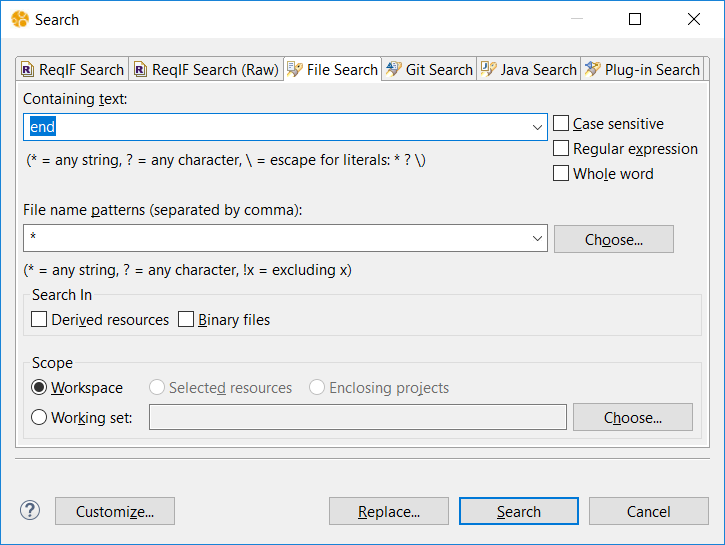

When you click on the `Serach` button, Eclipse performs the search.  The results are displayed in the `Search` view:


Double-clicking on a result in the view opens the editor to the location of the match.  All the matches are highlighted in the editor as well.


### Hyperlinks

All references to names in the AADL editor are linked to their declaration.  `CTRL`-clicking on the name will turn it into an active hyperlink and move the editor selection to the declaration of the name.  For example, `CTRL`-clicking on `MyProcess` in the subcomponent declaration of `MySystem` above, moves the selection to declaration of `MyProcess` earlier in the package.


### Quick Outline

A _quick outline_ can be brought up in the AADL text editor by typing `CTRL + o`.  The package outline will appear in a small window with a search box.  You can filter the displayed outline elements by typing in the search box:

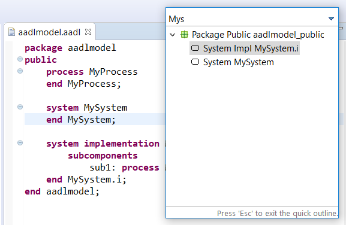

Selecting an item in the outline will move the editor to the selected element.


### Navigation History

Much like a web browser, when you navigate to different locations within a file, follow references/links to other files, go to the location of a marker, or go to the result of a search, Eclipse keeps a history. Yellow navigation arrow buttons in the toolbar let you move back adn forth through the history:


